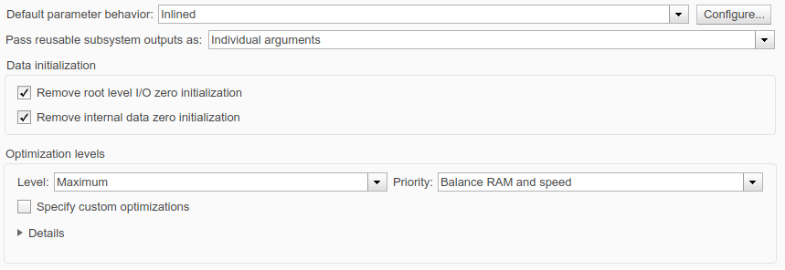
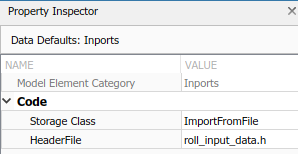

provided by xuyanghe  
2019-8-30
# GettingStartedEcoderExample详解
该教程在Matlab Help->Documentation->Embedded Coder->Getting Started with Embedded Coder  


## Step1：为嵌入式代码生成准备模型
该例子模型rtwdemo_roll展示了从Simulink模型自动生成C代码的过程，例子描述的是飞机自动驾驶仪控制系统。  
在该例子中，你将使用Embedded Coder® Quick Start来生成嵌入式代码。
它根据您的目标和应用程序选择基本的代码生成设置。  
### 1、打开示例模型
```sh
#Matlab终端输入
rtwdemo_roll
```

### 2、设置路径
设置MATLAB当前文件夹路径为可写入的目标路径。

### 3、打开Quick Start tool
在模型窗口，选择Code->C/C++ Code->Embedded Coder Quick Start

### 4、进入System页面
在Welcome界面下点击"Next"，进入System页面。在此页面上， 默认设置为"model"，这意味着为整个模型(包括子模型)自动生成代码。

### 5、进入Output界面
在该界面下，可以选择：  
1）默认生成C代码，也可以选择C++  
2）默认情况下C代码设置为Single instance，这意味着该程序不能多次实例化，如果想使用multi-instance，则自行选择。

### 6、进入Deployment界面
Deploy过程需要分析该模型的四个状态：  
1）你的模型采样频率是多少？  
2）你的模型是否包含连续(对应离散)模块？  
3）你是否为导出调用函数做了配置？  
4）你的模型是否包含引用模型？  
根据自动分析出来的结果，该工具将选择最适合的时间调度与求解器。  
例如，在该模型中，rtwdemo_roll只包含单一采样频率，为0.025HZ。

### 7、进入Word Size界面
选择生成代码所要使用的系统环境，该工具会自动调整变量的数据长度。

### 8、进入Optimization界面
该步骤能够选择代码配置目标的优先级，默认使用Execution efficiency，即生成的代码对执行效率更关注。

### 9、进入Generate Code页面
在该页面下，检查工具在前几个步骤中对模型自动生成代码的配置。

### 10、进入Complete页面
在该页面下，可以查看报告结果，以及显示下一步可以做的事情。

### 11、点击Finish结束


## Step2：检视并分析生成的代码
在Step1中，你已经使用Embedded Coder的Quick Start tool快速配置了rtw_roll例子的嵌入式代码生成方法，你可以通过点击code generation report检视生成的代码。  
你可以从Code->C/C++ Code->Code Generation Report->Open Model Report中查看报告结果。


### 1、Entry-Point函数的接口
从模型生成的代码将包含Entry-Point函数，也就是在你的上层应用中调用的函数接口，这些函数包括有初始化函数(initialization function)、执行函数(execution function)、选择函数(optionally function)、终止函数(teminate function)以及重置函数(reset function)。  
这些函数可以通过数据接口来改变上层应用程序中的数据。  
如果想检视这些接口，打开代码接口报告：  
#### 1）在生成报告的菜单栏中，点击Code Interface Report
#### 2）检视Entry-Point函数


#### 3）报告显示生成的代码定义了两个Entry-Point函数：rtwdemo_roll_step(execution function)、rtwdemo_roll_initialize(initialization function)
#### 4）检视接口参数  
&emsp;&emsp;该报告中显示没有定义可调的参数。  
&emsp;&emsp;默认情况下，代码生成器通过消除块参数(例如增益块的增益参数)的存储来生成有效的代码(也就是说所有非子模型的参数都是不可调的)。参数值在代码中显示为文本格式，因此你无法调节。  
&emsp;&emsp;如果你想获得一个可以调节的参数，比如PID控制器模型，则需要添加一个子模型BasicRollMode，你将在后续过程中发现这些参数成为了值可变全局变量，还可以为其配置可显示信号线的值可监视变量。  

生成的头文件rtwdemo_roll.h显示了模型接口元素，包括Entry-Point函数和全局变量。

### 2、子系统划分
该模型包含了三个子模型，比如BasicRollMode，这些子模型能够方便组织代码块，以及改善模型外观。默认情况下，子模型并不会影响代码生成。  
打开方式是在代码生成报告菜单栏下，选择Subsystem Report。报告中显示该模型内建了三个子模型。  
稍后，你可以将各个子模型所生成的代码模块化，这样子模型就成了一个分离的函数。


### 3、执行效率和计算资源消耗
默认情况下，optimizations能够让代码更高效，你可以在model configuration parameters中调整代码优化策略的优先级。  
配置方法为：  
#### 1）在rtwdemo_roll模型中，model configuration parameters->Code Generation->Optimization
#### 2）取消选择Specify custom optimizations
#### 3）点击ok
#### 4）点击model configuration parameters的Apply按钮
* 为了使一个计算资源优于另一个，在Optimization levels面板下，你可以调整优先级。例如，可以选择提高执行速度，而不是降低内存消耗。
* 要为数据分配更多的内存，，以便对其进行优化和监视，可以通过调整级别参数来降低优化的强度。  
  

如果要估计生成的代码在硬件上消耗的一些计算资源(如RAM和ROM)的数量，请在代码自动生成报告菜单栏下选择静态代码度量报告(Static Code Metrics Report)。  


### 4、Example Main程序
检视生成报告中的ert_main.c文件，你的应用程序可以在每次执行步骤中调用rt_OneStep函数，该函数调用了模型Entry-Point函数中的执行函数(execution function)，即rtwdemo_roll_step。
  

生成代码在文件ert_main.c中包含了main函数，但它是不完整的，为了在你的应用程序中使用Entry-Point函数，你需要替换掉该文件，或者直接在main函数中修改调用Entry-Point函数的方式。    
  

### 5、生成代码的文件结构
你的模型所生成的.c .h文件以及生成报告都在文件夹rtwdemo_roll_ert_rtw中。  
除了该文件夹还有一个slprj文件夹，其中存放的是子模型的文件。

### 6、模型和生成代码之间的可追溯性
模型和生成代码之间的对应关系都能够被追溯，这种特性能够帮助你写应用程序、debug生成的代码以及验证系统是否满足需求。  
在模型rtwdemo_roll中，HDG_Ref模块显示了系统的输入，为了找到该输入数据在生成代码中对应的位置：  
#### 1）在模型中单击HDG_Ref
#### 2）移动指针到···
#### 3）选择Navigate to Code图标

#### 4）生成代码报告中将高亮显示该选中的模块


如果想从生成代码报告中找到模型的对应位置，则只需要点击报告内的超链接。

## Step3：Entry-Point函数接口定制
在第二步中，你已经学会检视从rtwdemo_roll模型生成的报告。在该步骤中，你将学会如何自定义执行函数(execution function)，即rtwdemo_roll_step，以及初始化函数(initialization function)。接口中包含了函数的名字和数据，例如模型的输入和输出。  
### 1、函数名
设置执行函数(execution function)，即rtwdemo_roll_step，以及初始化函数(initialization function)。  
#### 1）在模型中，导航至configuration parameters->Code Generation->interface面板
#### 2）点击Configure Model Functions->Interface按钮
#### 3）为了配置函数名，在Configure C++ Class interface中将Step name修改为run，将Init name修改为init，点击ok


### 2、输入与输出数据
假想，有时候函数的输入参数可能是定义在某个头文件中的变量或者宏(固定参数，例如PID调参)，那么我们就需要把模型的输入参数链接到该头文件中。以该模型中的执行函数(run)为例，我们将自定义其输入输出数据，Matlab已经为该模型准备了变量名文件，只需在Matlab终端内输入：
```sh
copyfile(fullfile(matlabroot,'toolbox','rtw','rtwdemos','roll_input_data.c'));
copyfile(fullfile(matlabroot,'toolbox','rtw','rtwdemos','roll_input_data.h'));
copyfile(fullfile(matlabroot,'toolbox','rtw','rtwdemos','roll_heading_mode.c'));
copyfile(fullfile(matlabroot,'toolbox','rtw','rtwdemos','roll_heading_mode.h'));
```
现在，我们来配置模型数据Code Mapping的接口：
#### 1）选择Code->C/C++ Code->Configure Model in Code Perspective
#### 2）在model底部会生成Code Mapping和Model Data Editor，将Inports的Storage Class属性修改为ImportFromFile。  

这样设置以后，生成的代码将不会定义这些变量，而是#include你定义的头文件。
#### 3）点击Inports之后，在右边的Property Inspector中可以选择HeaderFile，填入头文件名。

#### 4）Outports修改过程与Inports类似，将Outports的Storage Class属性修改为ExportFile。
#### 5）点击Outports之后，在右边的Property Inspector中可以选择HeaderFile，填入头文件名。
#### 6）为了在生成代码中使用头文件内定义的变量，需要修改Configuration Parameters->Code Generation->Symbols->Global variables中rt$N$M变为$N$M，并点击Apply。原因是生成代码过程中会在全局变量头部添加"rt"。

上述过程只是修改输入与输出，如果具体到某个变量的配置，就需要修改Model Data Editor，在此修改的内容将覆盖Code Mapping内的对应部分内容。
#### 1）打开Model Data Editor->Inports/Outports

#### 2）将HDG_Mode一行，修改其Storage Class为ImportFromFile
#### 3）设置Header File为对应头文件

### 3、可调整参数
你可以在子模型BasicRollMode中配置PID控制器的控制参数，以及一些出现在代码中作为全局变量的相关信号，可以被调整和监视。  
默认情况下，代码生成优化会消除参数和非接口信号的存储。如果要调节特定参数以及与其相关的信号，则需要配置其为显式的。  

#### 1）在模型中，双击BasicRollMode子模型
#### 2）选择Model Data Eiditor->Parameters，其中包含了所有Simulink模块的参数
#### 3）如果要修改特定的参数，可以单击该模块，然后点击Filter contents左边的方按钮，就可以直接找到该参数。
#### 4）要使Model Data Eiditor显示当前子模型所使用的参数，点击刷新按钮
#### 5）假如要同时选择三个Gain模块，则按住Shift选择，就能选定相关参数。
#### 6）在Model Data Eiditor中选定三个模块相关的变量
#### 7）将三行Model Workspace的Storage Class属性均Convert to parameter object(直接单击Auto就能转换)。  
* 不能将存储类转换为数值变量，但是能转换为参数对象
#### 8）上一条中转换的作用是阻止优化器消除这些存储类，最后确定它们的Storage Class属性均为Model default。  
* 这样设置，这三个对象就会使用你在Code Mappings->Data Default->Local parameters设置的属性

#### 9）进入Model Data Editor->Signals面板
#### 10）这三个信号值，表示的就是三个Gain模块的输出信号
#### 11）同样的，设置这三者的Storage Class为Model Default
* 这样设置，这三个对象就会使用你在Code Mappings->Data Default->Internal data设置的属性

### 4、生成并检视代码
函数以及输入输出数据：
#### 1）为了将包含输入变量的头文件包含到生成代码中，需要在Configuration Parameters->Code Generation->Custom Code->Additional build information->Source files中加入这些头文件，并点击Apply。
#### 2）为了更新并重新生成代码以及报告，在模型中，点击Build Model按钮。

#### 3）在代码生成报告菜单栏下，选择Code Interface Report
#### 4）检视Entry-Point Functions，函数变成了你定义的名字
#### 5）检视Inports部分，顶层的Inport显示为导入的数据(Imported Data)，这意味着输入并没有定义为全局变量。
#### 6）检视Outports部分，顶层的Outport显示为全局变量(global variable)，你可以在Generated Code->Data files与Generated Code->Shared files内找到。
#### 7）检视Interface Parameters部分，三个参数对象显示为fields of a structure，名字为P，你可以自主调节这些参数。

接口报告并不标识你配置的三个Signals，但是可以在模型中追溯这三个信号在代码中的位置。
#### 1）在模型中，选择DispGain模块
#### 2）移动指针到···
#### 3）选择Navigate to Code图标
#### 4）生成代码报告中将高亮显示该选中的模块  
  
除了其他数据，此结构类型还包含三个字段，它们就对应DispGain模块的输出信号，该文件还声明了一个名为DW_I的全局结构变量，你的应用程序可以从变量中读取信号数据。  
通过控制生成的Entry-Point函数接口，可以生成与现有代码的交互。

## Step4：划分和模块化生成代码
在上一步，你已经学会了从实例模型rtwdemo_roll生成代码。默认情况下，算法代码出现在文件rtwdemo_roll.c的Entry-Point函数rtwdemo-roll-step内。  
在这一步，通过为模型中的每个子系统生成更多的文件和单独的函数来划分代码，将其组织成单独的函数和文件，使其易于读取和维护。
### 1、配置模型和子系统
#### 1）在模型中，点击Configure Parameters->Code Placement->File packaging format  
* 如果将参数设置为Compact(with separate data file)，将意味着代码生成器通过聚合数据、函数和类型定义来生成较少文件。
#### 2）通过将参数设置为Modular，将代码分发给更多的文件
#### 3）在Simulink模型界面，选择HeadingMode子模型
#### 4）打开Configure Model in Code Perspective(Crtl + Shift + C，或者看Step3->2、->1）)，在右侧Property Inspector->Code Generation
* 为了设置子系统分离成单独的函数，需要将Function packaging设置为Nonreusable function
* 设置Function name options为User specified，然后将函数名设置为func_HeadingMode
* 为了设置子系统分离成单独的文件(定义和声明分离)，将File name options设置为User specified。然后将文件名设置为def_HeadingMode，这种设置将使其代码生成为def_HeadingMode.c与def_HeadingMode.h。

#### 5）同理设置子系统RollAngleReference与BasicRollMode

### 2、检视生成的代码
#### 1）为模型生成代码
#### 2）检视更加模块化的文件结构。在报告菜单栏的Generated Code->Model files下，检视新文件rtwdemo_roll_private.h与rtwdemo_roll_types.h。这些文件将rtwdemod_roll.h的代码结构分离，比如全局变量的声明和一些类型的定义
#### 3）寻找HeadingMode子系统的表达。在模型中点击子系统，使用Navigate To Code追溯到代码，可以看到报告中显示def_HeadingMode定义了func_HeadingMode函数
#### 4）在报告中点击Highlight code for block的左键，可以追溯到在rtwdemo_roll.c文件中调用了func_HeadingMode
#### 5）在报告中的Generated Code->Subsystem files，检视所有生成的文件  


## Step5：部署和测试可执行程序
在本例中，您将验证生成的代码执行效果等同于Simulink中的模型。你将先用harness模式来测试rtwdemo_roll模型，然后使用SIL模式，然后用Simulation Data Inspector来对比仿真结果。  
为了测试代码，你可以使用software-in-the-loop(SIL)与processor-in-the-loop(PIL)仿真。SIL仿真在你的开发计算机上编译和运行代码，PIL仿真在你的开发计算机上交叉编译源码。然后，PIL仿真在目标处理器或等效指令集模拟器上下载并运行目标代码，您可以使用SIL和PIL仿真来：  
* 验证代码的数字变化
* 收集代码的覆盖率和执行时间度量
* 优化你的代码
* 实现IEC 61508、IEC 62304、ISO 26262、EN 50128或DO-178认证

### 1、检视和配置测试harness模型
实例模型rtwdemo_roll_harness通过模型块引用model-under-test、rtwdemo_roll。所谓harness模型就是给被测试的模型指定输入，并观察输出。你也可以很方便地在SIL、PIL仿真方法之间切换模型块。  
  
#### 1）打开实例模型rtwdemo_roll与rtwdemo_roll_harness  
* 终端输入：
```
rtwdemo_roll
rtwdemo_roll_harness
```
#### 2）在Matlab当前文件夹，保存rtwdemo_roll的复制
#### 3）在rtwdemo_roll_harness模型中，右键模型块，选择Subsystem & Model Reference->Refresh Selected Model Block
#### 4）在Matlab当前文件夹，保存rtwdemo_roll_harness的复制
#### 5）打开rtwdemo_roll与rtwdemo_roll_harness的Configure Parameters对话框
#### 6）对于两个模型，取消勾选Code Generation面板下的Generate code only复选框
* 为了运行SIL和PIL仿真，必须取消Generate code only复选框
#### 7）对于两个模型，在Hardware Implementation->Device details面板，确认已经勾选Support long long复选框
* 对于该模型，为了运行SIL和PIL仿真，必须勾选Support long long复选框
#### 8）点击ok，保存模型

### 2、用普通模式仿真
用普通模式运行harness模型，并在Simulation Data Inspector内获取仿真结果。
#### 1）在rtwdemo_roll_harness模型下，选择View->Model Data Editor
#### 2）在Model Data Editor下，选择Signals
#### 3）将Change view下拉框中的Design设置为Instrumentation
#### 4）在data列表内，按下Crtl + A，选中所有行
#### 5）要将所有信号配置为将仿真数据记录到Simulation Data Inspector，请选中"Log Data column"复选框，然后确保所有复选框都为勾
#### 6）右键模型块Roll Axis Autopilot，选择Block Parameters
#### 7）在Block Parameters对话框中，确保Simulation mode为Normal，点击ok
#### 8）仿真rtwdemo_roll_harness
#### 9）当仿真完毕，在Simulation Data Inspector中查看仿真结果，如果Simulation Data Inspector并没有打开，在Simulink Editor内，点击Simulation Data Inspector按钮
  
#### 10）对每一次run，都可以重新命名run结果，这里重命名为roll_harness：Normal mode
#### 11）选择Ail_Cmd复选框以显示仿真曲线  
  
### 3、用SIL模式仿真
SIL仿真在你的开发计算机上编译和运行代码，在Simulation Data Inspector中查看仿真结果：
#### 1）右键模型块Roll Axis Autopilot，选择Block Parameters
#### 2）在Block Parameters对话框中，选择Simulation mode为Software-in-the-loop(SIL)，点击ok
#### 3）从生成过程中排除外部的代码文件。在Configuration Parameters->Code Generation->Custom Code->Adiitional build information->Source files中，设置为默认值(当前应该是空的)，然后保存模型
#### 4）仿真rtwdemo_roll_harness
#### 5）run重命名为roll_harness：SIL mode
#### 6）选择Ail_Cmd复选框以显示仿真曲线

### 4、对比仿真结果
在Simulation Data Inspector中：
#### 1）点击Compare标签
#### 2）在Baseline下拉选框选择roll_harness：Normal mode
#### 3）在Compare To下拉选框选择roll_harness：SIL mode
#### 4）点击Compare  
  
Simulation Data Inspector显示了Normal mode和SIL mode的结果对比。对比该两种模式的仿真结果能够帮助你验证所生成应用的运行表现与你的预期一致。